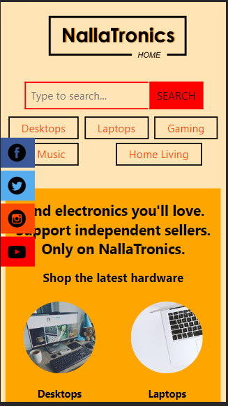
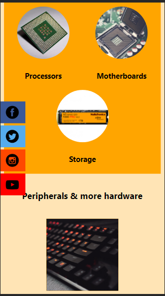
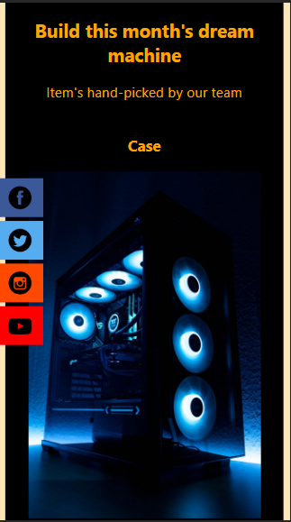
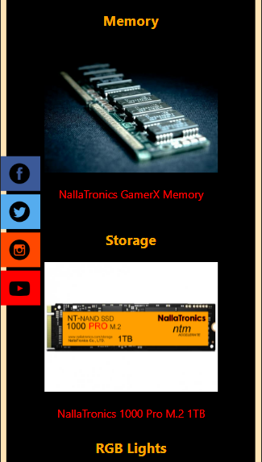
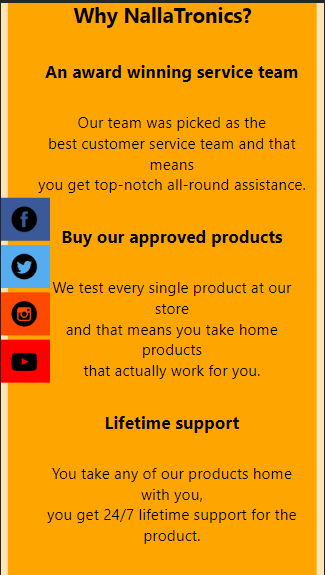
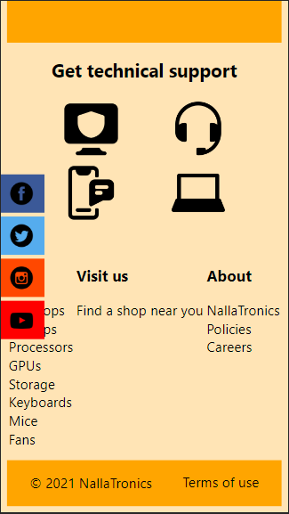

# NallaTronics landing page

This is the first website I ever built. At the time, I had just finished learning the fundamentals of HTML5 and CSS3.

## Table of contents

-  [Overview](#overview)
   -  [The challenge](#the-challenge)
   -  [Screenshot](#screenshot)
-  [My process](#my-process)
   -  [Built with](#built-with)
   -  [What I learned](#what-i-learned)
   -  [Continued development](#continued-development)
   -  [Useful resources](#useful-resources)
-  [Author](#author)

## Overview

### The challenge

I wanted to put all my basic skills together to build a project. I decided I was going to make a clone of [Etsy](https://www.etsy.com/). The idea was for me to try to clone the site with a touch of my own design and content.

I started working on the project on _30th November 2020_. I was on and off the project for the rest of _December_, but I'm glad I set aside some time and finished working on it on _9th January 2021_. I honestly believe that if I had abandoned the project then, I wouldn't have started down this web development path.

### Screenshot


Screenshot of the top of the page in desktop view.

What's in view:

-  At the top:

   -  a custom title icon I made for the page
   -  another custom logo I designed for the _Homepage_
   -  the first search bar I ever coded
   -  also, the first navigation bar I ever coded. At the time, I didn't even know to call it a navigation bar

-  At the center:
   -  some social icons I set to have a fixed position
   -  a hero message
   -  some circled out images (I had never worked with so many images in my life :D)

---


Screenshot of the lower top of the page.

What's in view:

-  A peripherals section featuring more images and some really cool hover effects. On _hover_, you get to see more information about that particular peripheral or device and are given a link to a peripherals page.

---


Screenshot of the center of the page.

What's in view:

-  A section that features the month's top choices of parts for bulding a computer. This section is quite memorable. I can never forget the headaches I got while trying to figure out the layout for this section.

---


Screenshot of the bottom of the page

What's in view:

-  At the top:
   -  More information about the site
-  At the center:
   -  Support links
-  At the bottom:
   -  Links to external pages and below that, not shown in the screenshot,s is a footer

---


Screenshot of one of the external pages.

What's in view:

-  When you click on any of the links found throughout the page, you'll be taken to an external page such as the one shown above. The page contains a custom logo (top left), a coming soon text and a link back to the _homepage_

---


Screenshot of a general overview of the homepage.

What's in view:

-  This is a screenshot of how the site looks on desktops.

---








Screenshots of the site in mobile view.

---

## My process

### Built with

-  HTML5 markup
-  CSS
-  Flexbox
-  Desktop-first workflow
-  [Inkscape](https://inkscape.org)

### What I learned

-  Being self taught is quite difficult. This was quite apparent as I was working on the project. I didn't know anyone who could have even remotely steered me in the right direction. It felt like I was fumbling in the dark when I was building this. I basically told myself, "No matter how long it takes, I'm going to finish this project," and so I did. I'm so proud of myself for never giving up.

-  I remember when I started, I had no idea what a navigation bar was. If I were to ask someone for help back then, I would have said something along the lines of, "Hey, how do I make this _menu_ look good on mobile?" :D

-  Overall, this project gave me a chance to combine everything I knew at the time about **HTML** and **CSS**, into something beautiful.

Here are some code snippets of code that made me feel like I could achieve anything:

Code to make the first set of images rounded

```css
.circled-pics {
   border-radius: 50%;
   overflow: hidden;
}
```

Code to make the social icons have a fixed position and a simple transition effect on hover.

```css
.icons {
   top: 50%;
   left: 0;
   transform: translateY(-50%);
   position: fixed;
   z-index: 100;
}
.icons ul li:hover {
   padding-left: 20px;
   width: 50px;
   transition: 0.6s;
}
```

This code is part of the code that handles the cool hover effects in the peripherals section.

```css
.container .box:hover .details {
   transform: scaleY(1);
}
```

### Continued development

It feels like ages since I built this project. Since then, I've been able to learn a lot more about HTML, CSS, JavaScript, and other web technologies too.

I'll preserve this project as it is to remind me of where I started and the far that I've come on my self taught journey.

I plan to make a **remastered** version of the site using my current skills. The newer site will have working external pages, better UI and UX, and I might even make the project consume an external API by making it an e-commerce website.

I'll link the newer version here when it's done.

### Useful resources

-  [Inkscape](https://inkscape.org) - Inkscape SVG Editor. This project is where I first started leveraging the power of Inkscape. My skills using the editor have greatly improved since then, thus making it my go-to design tool for designing web projects.

## Author

-  Github - [@AllanKirui](https://www.github.com/AllanKirui)
-  Frontend Mentor - [@AllanKirui](https://www.frontendmentor.io/profile/AllanKirui)
-  Instagram - [@nallawilljr](https://www.instagram.com/nallawilljr)

[Back to top](#nallatronics-landing-page)
