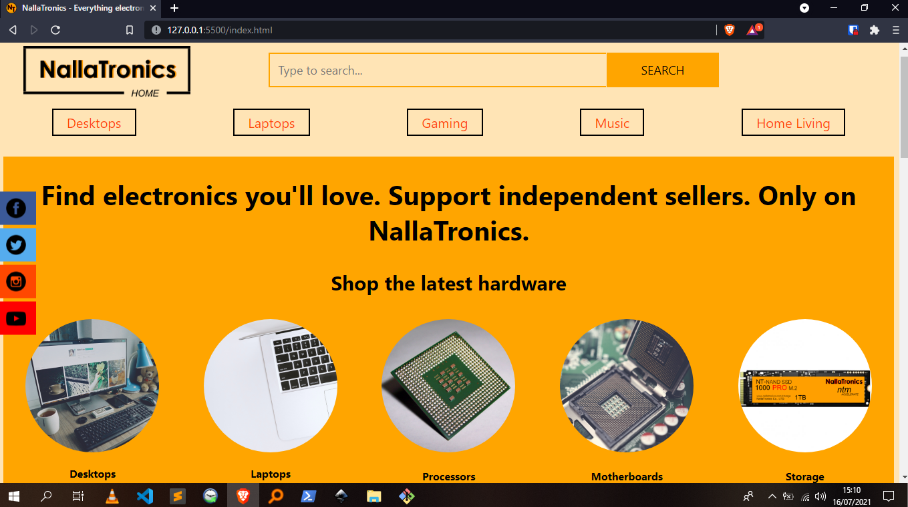
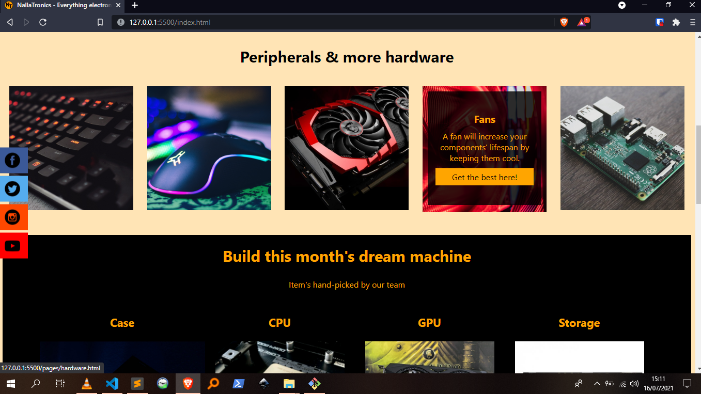
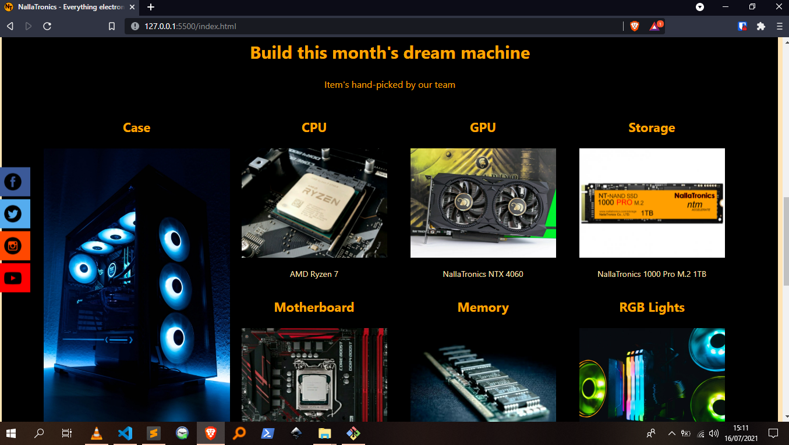
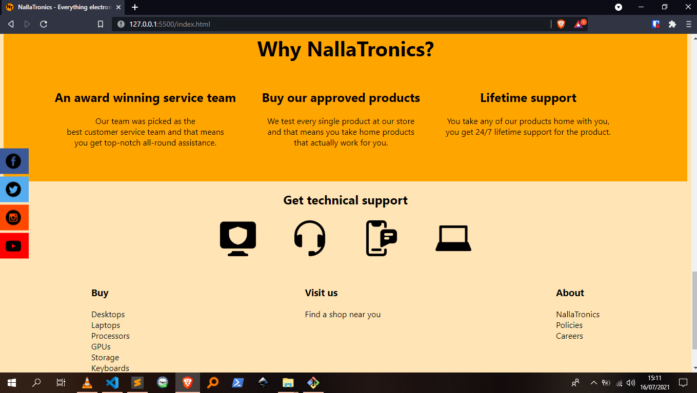
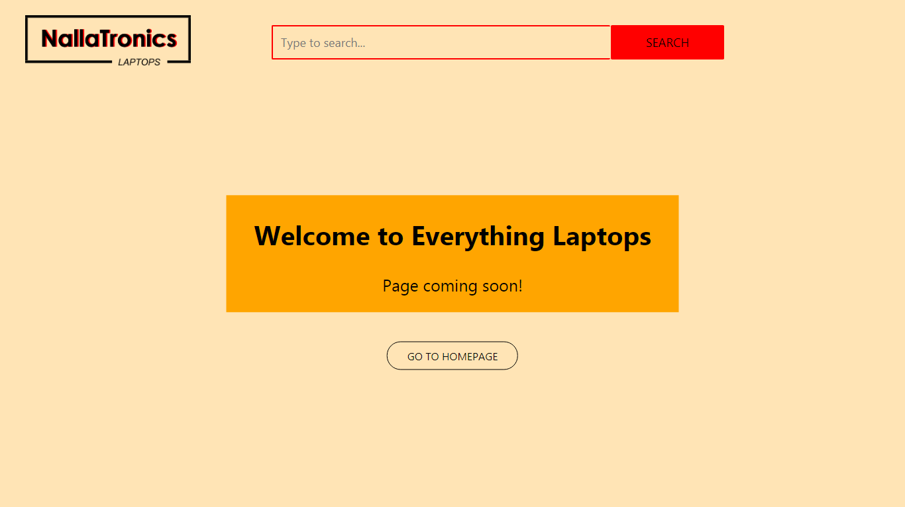
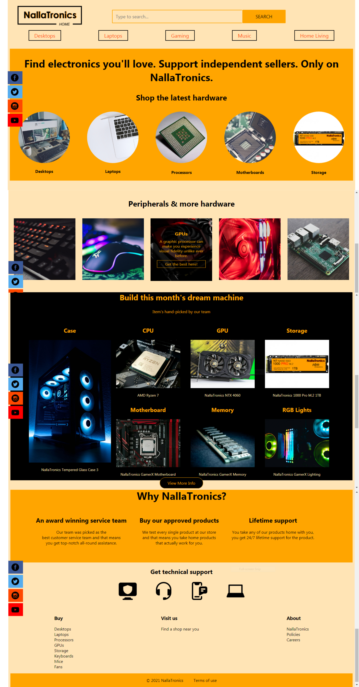

# NallaTronics landing page

This is the first website I ever built. At the time, I had just finished learning the fundamentals of HTML5 and CSS3.

## Table of contents

-  [Overview](#overview)
   -  [The challenge](#the-challenge)
   -  [Screenshot](#screenshot)
   -  [Links](#links)
-  [My process](#my-process)
   -  [Built with](#built-with)
   -  [What I learned](#what-i-learned)
   -  [Continued development](#continued-development)
   -  [Useful resources](#useful-resources)
-  [Author](#author)
-  [Acknowledgments](#acknowledgments)

## Overview

### The challenge

I wanted to put all my basic skills together to build a project. I decided I was going to make a clone of [Etsy](https://www.etsy.com/). The idea was for me to try to clone the site with a touch of my own designs and content.

I started working on the project on _30th November 2020_. I was on and off the project for the rest of _December_, but I'm glad I set aside some time and finished working on it on _9th January 2021_. I honestly believe that if I had abandoned the project, I wouldn't have started down this web development path.

### Screenshot



Screenshot of the top of the page in desktop view.

What's in view:

-  At the top:

   -  a title icon I made for the page
   -  another custom logo I designed for the _Homepage_
   -  the first search bar I ever coded
   -  also, the first navigation bar I ever coded. At the time, I didn't even know to call it a navigation bar

-  At the center:
   -  some social icons I set to have a fixed position
   -  a hero message
   -  some circled out images (I had never worked with so many images in my life :D)

---



Screenshot of the lower top of the page.

What's in view:

-  A peripherals section featuring more images and some really cool hover effects. On _hover_, you get to see more information about that particular peripheral or device and are given a link to a peripherals page.

---



Screenshot of the center of the page.

What's in view:

-  A section that features the month's top choices of parts for bulding a computer. I remember this section like it was just yesterday. I can never forget the headaches I got when trying to figure out they layout for this section.

---



Screenshot of the bottom of the page

What's in view:

-  At the top:
   -  More information about the site.
-  At the center:
   -  Support links
-  At the bottom:
   -  Links to external pages and below that (not shown in the screenshot) is a footer

---



Screenshot of one of the external pages.

What's in view:

-  When you click on any of the links found throughout the page, you'll be taken to an external page such as the one shown above. The page contains a custom logo (top left), a coming soon text and a link back to the _homepage_

---



Screenshot of a general overview of the homepage.

What's in view:

-  This is an actual screenshot of the site in the design file.

---

## My process

### Built with

-  HTML5 markup
-  CSS
-  Flexbox
-  Desktop-first workflow
-  [Inkscape](https://inkscape.org)

### What I learned

-  Being self taught is quite difficult. This was quite apparent as I was working on the project. I didn't know anyone who could have even remotely steered me in the right direction. It felt like I was fumbling in the dark when I was building this. I basically told myself, "No matter how long it takes, I'm going to finish this project," and so I did. I'm so proud of myself for never giving up.

-  I remember when I started, I had no idea what a navigation bar was. If I were to ask someone for help back then, I would have said something along the lines of, "Hey, how do I make this _menu_ look good on mobile?" :D

-  Overall, this project gave me a chance to combine everything I knew at the time about **HTML** and **CSS**, into something beautiful.

Use this section to recap over some of your major learnings while working through this project. Writing these out and providing code samples of areas you want to highlight is a great way to reinforce your own knowledge.

To see how you can add code snippets, see below:

```html
<h1>Some HTML code I'm proud of</h1>
```

```css
.proud-of-this-css {
   color: papayawhip;
}
```

```js
const proudOfThisFunc = () => {
   console.log("🎉");
};
```

If you want more help with writing markdown, we'd recommend checking out [The Markdown Guide](https://www.markdownguide.org/) to learn more.

**Note: Delete this note and the content within this section and replace with your own learnings.**

### Continued development

Use this section to outline areas that you want to continue focusing on in future projects. These could be concepts you're still not completely comfortable with or techniques you found useful that you want to refine and perfect.

**Note: Delete this note and the content within this section and replace with your own plans for continued development.**

### Useful resources

-  [Example resource 1](https://www.example.com) - This helped me for XYZ reason. I really liked this pattern and will use it going forward.
-  [Example resource 2](https://www.example.com) - This is an amazing article which helped me finally understand XYZ. I'd recommend it to anyone still learning this concept.

**Note: Delete this note and replace the list above with resources that helped you during the challenge. These could come in handy for anyone viewing your solution or for yourself when you look back on this project in the future.**

## Author

-  Website - [Add your name here](https://www.your-site.com)
-  Frontend Mentor - [@yourusername](https://www.frontendmentor.io/profile/yourusername)
-  Twitter - [@yourusername](https://www.twitter.com/yourusername)

**Note: Delete this note and add/remove/edit lines above based on what links you'd like to share.**

## Acknowledgments

This is where you can give a hat tip to anyone who helped you out on this project. Perhaps you worked in a team or got some inspiration from someone else's solution. This is the perfect place to give them some credit.

**Note: Delete this note and edit this section's content as necessary. If you completed this challenge by yourself, feel free to delete this section entirely.**
